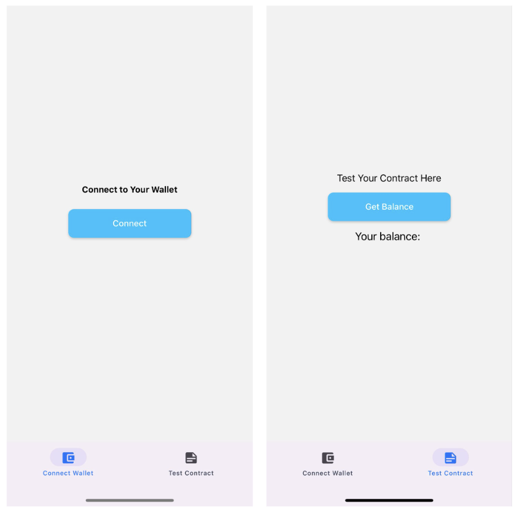

# [create-rn-mobile-dapp](https://www.npmjs.com/package/create-rn-mobile-dapp)

Get started with creating your decentralised application (dApp) with React Native using this boilerplate code.

This boilerplate code serves as a quick development playground for developing mobile dApps on local blockchain. 

To get started, install the npm package
```
npm i create-rn-mobile-dapp
```
Then, start the boilerplate code:
```
npx create-rn-mobile-dapp my-dapp
```
>Replace my-dapp with your project name

- Run `npm install` to install the packages in `package.json`. 

- Create a `.env` file in the project's root directory. 
**Make sure this file is in `.gitignore`** 

## Setting up </br>
Ensure the following are installed and setup.

**1. Install Ganache-CLI by following the guide [here](https://docs.nethereum.com/en/latest/ethereum-and-clients/ganache-cli/).** </br></br>
    To run, enter this into a new terminal
    ```
    ganache-cli --server.host 0.0.0.0 --server.port 8545
    ```
    This will create an instance of some test accounts with balance that are free to use for development.

**2. Create a WalletConnect project ID by following [this guide](https://docs.walletconnect.com/web3inbox/cloud-setup)**</br></br>
    Copy the project ID into `.env` file in the format:</br>
    ```
    REACT_APP_WALLETCONNECT_PROJECT_ID=PROJECTID
    ```
    </br></br>
**3. Setup the test device (iPhone) (require iOS>13.2):** </br></br>
    Enable the developer mode on the test device. See guide [here](https://developer.apple.com/documentation/xcode/enabling-developer-mode-on-a-device).</br>

**4. Install MetaMask on the test device** </br></br>
After Login, go to `Settings>Networks>Add Network>Custom networks` </br>
Enter the details as follows to add the network:</br>

- Network Name: localhost (or any name)
- RPC Url : `http://<ip_address_of_local_machine>:8545`
- Chain ID : 1337
- Symbol: ETH

**On the home page, change the network to the custom network created. Make sure you are not on Ethereum Main Network.**

Next, import the account created from Ganache CLI into MetaMask mobile by clicking on `Import Account`. Paste the private key from the Ganache CLI terminal for the account you wish to import here. </br>

Upon successful import, you should be able to see the address, and the balance.

**5. Compile and Deploy your smart contract on Remix IDE.**

- Compile your smart contract and copy the contract ABI into the `src/data/contractInfo.js` file in this repository.
- Change the environment to `Dev - Ganache Provider` before deploying the smart contract.
- Obtain the contract address after deploying the contract and place it in the same file as the contract ABI.


## Building the app

**1. In the project's root directory, install the pods by running in the terminal:**</br>
```
cd ios && pod install && cd ..
```

**2. Connect your test device to the local machine and open the project in Xcode.**</br>

>Open the `.xcworkspace` file instead of the `.xcodeproj`.

**3. On the terminal, run:**</br>
```
npx react-native run-ios --device "Your device name"
```
This will start the metro server and launch the application on your device.

**4. Connect to your MetaMask mobile account by pressing on the connect button in the app.**

Test your smart contract by calling them in `testContract.js` using `ethers.js` or `web3.js`. </br></br>
